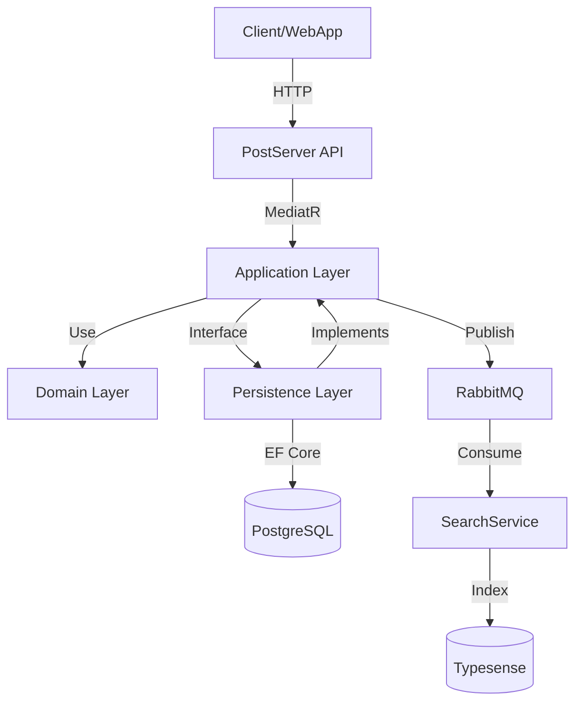

# Overflow DDD 架构文档

## 1. 项目结构概览

本项目采用领域驱动设计 (DDD) 架构，分为以下核心层级：

- **Domain (领域层)**: 包含核心业务逻辑和实体。
- **Application (应用层)**: 处理用例、协调领域对象、定义接口契约。
- **Persistence (基础设施层/持久化)**: 实现数据访问和业务逻辑的具体技术细节。
- **PostServer (表示层/API)**: 暴露 API 接口，处理 HTTP 请求。
- **SearchService (基础设施层/搜索)**: 处理搜索相关的后台逻辑。

---

## 2. 各层级详细说明

### 2.1 Domain (领域层)
**职责**:  encapsulate 核心业务规则，不依赖任何外部框架。

#### 文件分布:
- `Domain/Entity/PostServer/Post/`
    - `PostQuestion.cs`: 提问实体，包含标题、内容、标签、投票等业务逻辑。
    - `PostAnswer.cs`: 回答实体，包含内容、是否采纳等逻辑。
    - `PostTag.cs`: 标签实体。
- `Domain/Exceptions/Rules/`
    - `EntityRuleException.cs`: 领域规则校验异常。

#### 引用关系:
- **被引用**: Application, Persistence
- **引用**: 无（纯净的核心层）

---

### 2.2 Application (应用层)
**职责**: 协调领域对象完成具体用例，定义仓储接口，处理 DTO 转换。

#### 文件分布:
- `Application/Contracts/`
    - `Repositories/`: 定义仓储接口 (如 `IPostQuestionRepository`)。
    - `Persistence/`: 定义工作单元接口 (`IUnitOfWork`)。
- `Application/MediatR/`
    - `Commands/`: 定义写操作命令 (CQRS 的 C)。
    - `Queries/`: 定义读操作查询 (CQRS 的 Q)。
    - `Handlers/`: 处理命令和查询的逻辑，协调 Domain 和 Repository。
    - `Validators/`: 使用 FluentValidation 进行输入校验。
- `Application/DTO/`
    - `PostServer/PostQuestions/`: 定义数据传输对象 (DTO)。
- `Application/Common/`
    - `Response/`: 统一响应格式 `ServiceResponse<T>`。
    - `Queues/`: 消息队列模型定义。
- `Application/Extensions/Mapper/`
    - `PostServerMapConfig.cs`: Mapster 映射配置。

#### 引用关系:
- **被引用**: PostServer, SearchService, Persistence
- **引用**: Domain

---

### 2.3 Persistence (基础设施层 - 持久化)
**职责**: 实现 Application 层定义的接口，负责与数据库交互。

#### 文件分布:
- `Persistence/Repositories/PostServer/`
    - `PostQuestionRepository.cs`: 实现 `IPostQuestionRepository`。
    - `PostAnswerRepository.cs`: 实现 `IPostAnswerRepository`。
    - `PostTagRepository.cs`: 实现 `IPostTagRepository`。
    - `Repository.cs`: 泛型仓储基类。
- `Persistence/UnitsOfWork/`
    - `UnitOfWorkEFCore.cs`: 实现 `IUnitOfWork`，管理 EF Core 事务。
- `Persistence/Configs/`
    - `PostServerConfigs.cs`: EF Core 实体配置。
- `Persistence/PostServerDbContext.cs`: 数据库上下文。

#### 引用关系:
- **被引用**: PostServer (通过 DI 注册)
- **引用**: Application, Domain

---

### 2.4 PostServer (表示层)
**职责**: 处理 HTTP 请求，身份验证，调用 Application 层的 MediatR。

#### 文件分布:
- `PostServer/Controllers/`
    - `PostQuestionController.cs`: 暴露 RESTful API。
- `PostServer/DTO/Post/`
    - `CreatePostQuestionDto.cs`, `UpdatePostQuestionDto.cs`: API 接收的请求模型。
- `PostServer/Validators/`: API 层面的校验器。
- `PostServer/Program.cs`: 服务启动入口，配置 DI 容器。

#### 引用关系:
- **引用**: Application, Persistence, Overflow.ServiceDefaults

---

### 2.5 SearchService (基础设施层 - 搜索)
**职责**: 监听消息队列，同步数据到搜索引擎 (Typesense)。

#### 文件分布:
- `SearchService/Handlers/`: Wolverine 消息处理器。
- `SearchService/Data/`: 搜索服务相关的数据逻辑。
- `SearchService/Models/`: 搜索模型。

#### 引用关系:
- **引用**: Application, Overflow.ServiceDefaults

---

## 3. 核心业务流程示例：创建问题

1. **Request**: 客户端向 `PostQuestionController.CreatePostQuestion` 发送 POST 请求。
2. **Mapping**: Controller 将 DTO 转换为 `PostQuestionCreateCommand`。
3. **MediatR**: Controller 调用 `mediator.Send(command)`。
4. **Handler**: `PostQuestionCreateCommandHandler` 接收命令。
    - 执行 `Validator` 校验。
    - 调用 `IPostTagRepository` 校验标签有效性。
    - 实例化 `Domain.Entity.PostQuestion` (触发领域规则校验)。
    - 调用 `IPostQuestionRepository.AddAsync`。
    - 调用 `IUnitOfWork.CommitAsync` 提交事务。
    - 发布 `PostQuestionMqCreated` 消息到 RabbitMQ。
5. **Response**: 返回 `ServiceResponse<PostQuestionDto>`。
6. **Background**: `SearchService` 消费消息并更新 Typesense 索引。

---

## 4. 依赖注入与注册

- **Application**: `RegisterApplicationServices.cs` 注册 MediatR, Mapster, Validators。
- **Persistence**: `RegisterPersistenceServices.cs` 注册 Repositories 和 UnitOfWork。
- **PostServer/Program.cs**: 
    - 调用 `AddApplicationServices()` 和 `AddPersistenceServices()`。
    - 配置 Keycloak 认证。
    - 配置 Wolverine + RabbitMQ。

---

## 5. 架构图示 (Mermaid)

